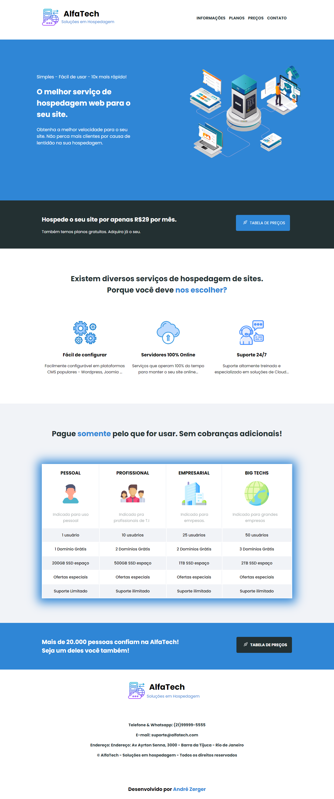

# AlphaTech — Website de Hospedagem

Landing page responsiva para uma empresa fictícia de hospedagem web, com foco em apresentação visual, planos e navegação simples.

## Funcionalidades

- Layout responsivo para desktop, tablet e celular
- Seção de apresentação dos serviços
- Página de preços e comparação de planos
- Navegação e rodapé com links de apoio
- Estilos e animações utilizando CSS

## Tecnologias

- HTML5
- CSS3
- Google Fonts

## Organização dos arquivos

- `index.html`: página principal
- `tabela-precos.html`: página de planos e preços
- `style.css` e `estilo.css`: estilos visuais
- `pagina-alfatech.png` e `tebela-precos.png`: imagens de prévia

## Como visualizar

Abra o arquivo `index.html` no navegador. Para navegar até os planos, utilize o link disponível na página principal.

## Objetivo

Projeto desenvolvido para demonstrar fundamentos de desenvolvimento front-end, organização visual e criação de uma página comercial responsiva.

## Autor

André Zerger Bigaran
